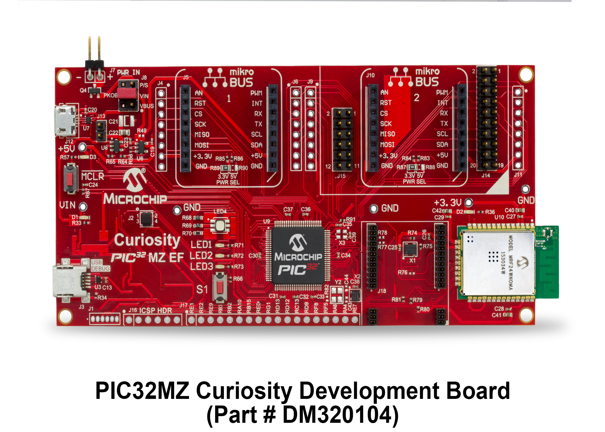

The Curiosity PIC32 MZ EF Development Board is a fully integrated 32-bit development platform featuring  the  high performance  PIC32MZ EF Series (PIC32MZ2048FM)  that  has a  2MB Flash, 512KB RAM,  integrated  FPU ,Crypto accelerator  and  excellent connectivity options. 
The Curiosity Development Board includes an integrated programmer/debugger ,an on board   Wi-Fi-N module MRF24WN0MA-I/RM100  and is fully integrated  with  Microchip’s MPLAB® X IDE 
###For More Info Check out###
[Curiosity PIC32MZEF Development Board Product Page](http://www.microchip.com/developmenttools/productdetails.aspx?partno=dm320104)
- [Curiosity PIC32MZEF Downloadable Projects](DownloadableProjects/)
