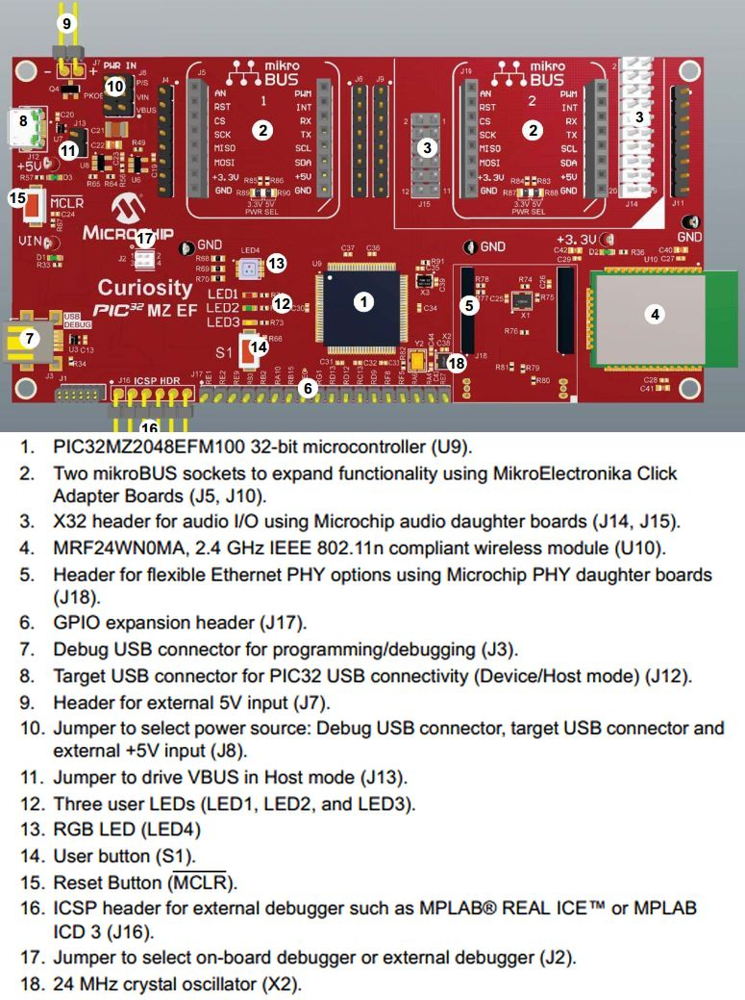
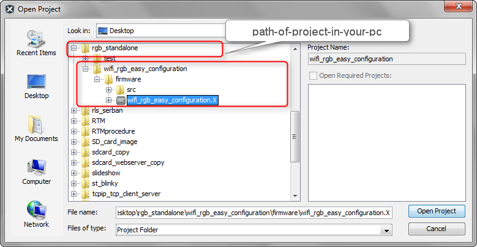
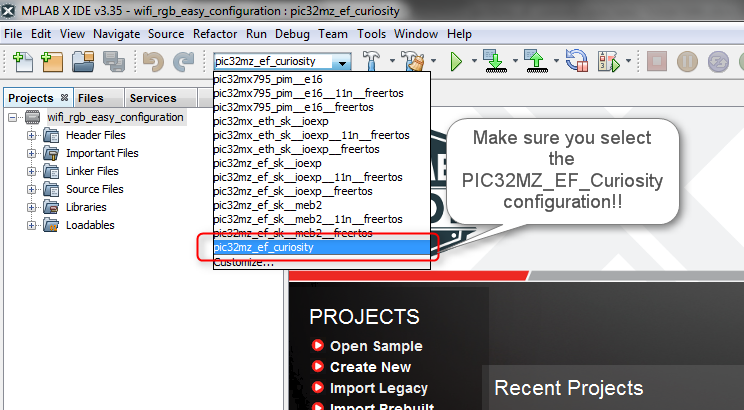
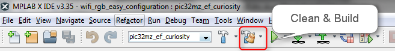
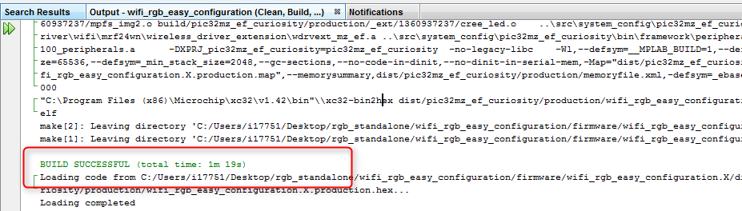
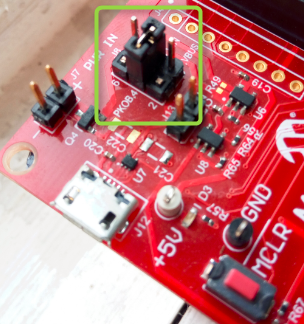
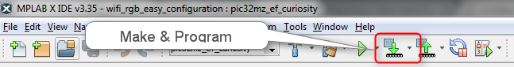
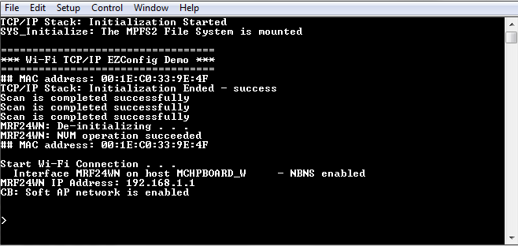
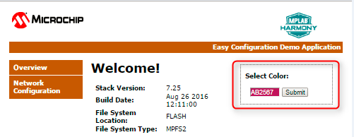
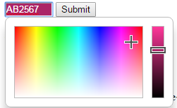

# PIC32MZ EF Curiosity #

## WiFi RGB Easy Configuration Demo ##
----------

### Introduction ###
The WiFi RGB Easy Configuraion demo showcases on how to configure an embedded WiFi device, that does not have a natural keyboard and screen. By using the internal webserver that accompanies the Microchip TCP/IP stack, end-users can use their browser as a conduit for programming the WiFi device with the correct network parameters.

The **PIC32MZ EF Curiosity Development Board** has on on-board MRF24WN0MA WiFi module, which can be configured using this demo. Also the demo features changing the color of the on-board RGB LED using the web-page hosted by by the Curiosity board.

![PIC32MZ EF Curiosity Overview]

----------
>>>>>>>>>>>>>>>

###Required Microchip Tools and Applications###

You will need the following Microchip development tools to run WiFi RGB Easy Configuration demo:

1. PiC32MZ EF Curiosity Development Board ( DM320104), available from [Microchip Direct](http://www.microchipdirect.com/productsearch.aspx?Keywords=DM320104)
2. Download and install [Latest MPLAB® X Integrated Development Environment](http://www.microchip.com/mplab/mplab-x-ide)
3. Download and Install [Latest MPLAB® XC32 Compiler](http://www.microchip.com/mplab/compilers)
4. Optionally Download and install [Latest MPLAB® Harmony Integrated Software Framework](http://www.microchip.com/mplab/mplab-harmony). 

> ##### Note: #####
> Using MPLAB® Harmony Integrated Software Framework you will be able to extend the functionality of this project by adding new modules, software frameworks and libraries to your project.

----------
>>>>>>>>>>>>>>>
###Building the Application###

- Download the project from GitHub to your local PC.
- To build this project, you must open (In MPLAB X, `File>Open Project`) the `wifi_rgb_easy_configuration.X ` project (from `<path-of-project-in-your-pc>/pic32mz_ef_curiosity/software/tcpip/wifi_rgb_easy_configuration/firmware`) in MPLAB X IDE, as shown below. 

- On the MPLAB X IDE select the `pic32mz_ef_curiosity` configuration, as shown below.

 

> ##### Note: #####
> The other configurations wont work under standalone mode. However if you want to work with this project for other configurations listed, you can migrate this project into a Harmony project, and then build for other configurations.

- The `pic32mz_ef_curiosity` configuration sets up MPLAB X IDE to build and run the demonstration application on the PIC32MZ EF Curiosity Development Board, with the `PIC32MZ2048EFM100` microcontroller. The WiFi driver is initially configured to operate in SoftAP mode, so that it works as a WiFi hotspot.

- Clean and Build the project.

- Check the Build log, at the bottom of the MPLAB X IDE

----------
>>>>>>>>>>>>>>>
###Configuring the Hardware###
- Ensure that a jumper is placed on 4-3 on J8 on the **PIC32MZ EF Curiosity Development Board**

----------
>>>>>>>>>>>>>>>
###Running the Demo###

**1.** Compile and program the target device. While compiling, select the `pic32mz_ef_curiosity` configuration.

**2.** When the demonstration runs, it scans for local Access Points and outputs the results to the serial console. After the scan results, the MRF24WN goes into SoftAP mode (where it behaves like an Access Point) and outputs the following to the serial console:  

**3.** From a smartphone or personal computer,connect to the `Curiosity_RGBLED_AP` network, which is the SoftAP network started by the demonstration. Then, bring up a web page by entering the IP address of the SoftAP network into the smartphone browser. This is the IP address displayed in step 2 (e.g., 192.168.1.1). When the web page is displayed:

- On the right top corner of the page, there is a widget through which we can change the color of the RGB LED which is on the Curiosity board.

> ##### Note: #####
>Click on the text box to get a pop-up to select color of the RGB LED.
> 
>

- Select **Network Configuration**, and then **Scan for Wireless Networks**. The MRF24WN will display the list of wireless networks on the web page. 
- Select the desired AP to which the MRF24WN should_connect_by clicking the name of the AP.
- The MRF24WN will then connect to that Access Point and write the configuration information to non-volatile memory.
- The console output will show the new connection taking place.

**4.** If you rerun the demonstration, it will automatically connect to the selected AP (The AP we selected in the previous step), as the configuration data stored in non-volatile memory will be used to reconnect to the desired AP.

Connect the PC to the same AP to which the board is connected. Then open the serial terminal as in STEP2, and get the IP address which the board has got from the newly selected AP. Type this IP address on the browser and the RGB demo web page should come up on the browser. Try out changing the RGB color and the Network settings through the newly establsihed connection. 

**5.** To reset and run the demonstration from the beginning, erase the stored configuration by bringing up the demonstration, and at the command line type **`deleteconf`**.
 

